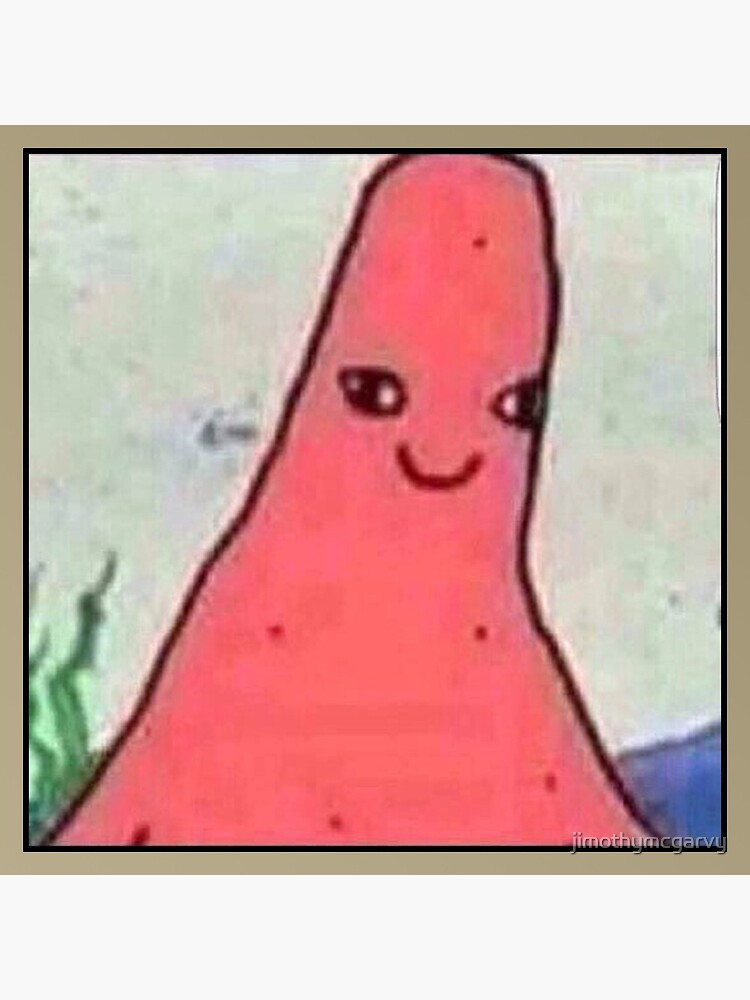
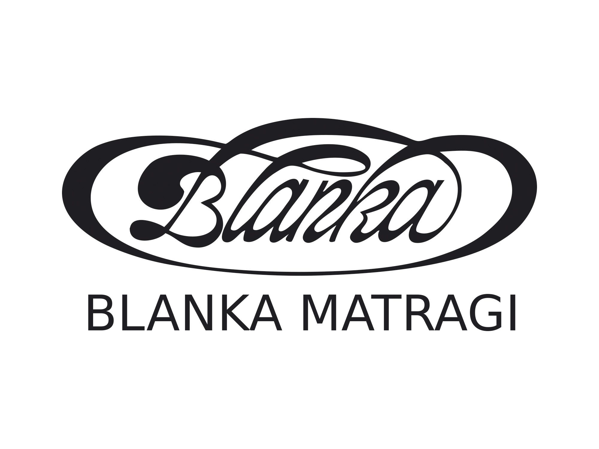
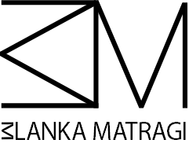

## About me

### About me - short version
(My name is Patrik and) I like to express myself through digital design, art and music. (87 characters)

### About me - long version
(My name is Patrik and) I love to follow my passion. In my free time I enjoy playing musical instruments (guitar, didgeridoo, piano, tibetian bowl, and others). Musical instruments help to heal my body, mind and soul and my big goal and path I am heading is to help others through music and sound healing. (304 characters)

### Case study - Blanka Matragi
I chose to do a case study on Blanka Matragi's logo redesign, which is one of our projects from our atelier based in Vysoká škola kreativní komunikace.

#### Comparison of "before and after"

Before:

//This old logo has very thick lines and is very old fashioned

After:

//The final logo is more technical and very minimalistic

(326 characters, pure text) | excuse the formatting and image sizes
