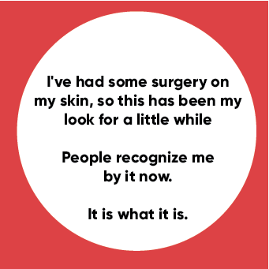

## Case study: Gregory Porter ##

Gregory Porter is an American singer, songwriter and actor. He is recognizable for wearing a hat. He wears that hat, because he had a surgery on his head.

Our school project with 3 more colleagues was to make CD covers for Gregory Porter. It was a great experience.

Each CD cover has a front and back side + one "quote page" which contains a quote that represents his album.
Here are some of the CD covers we created:

## The first album is called Wolfcry: ##

## Second album is called Holding on: ##

## 3rd album is called Harlem: ##

## 4th album is called Love: ##

## 5th album is called Stars: ##

## 6th and last album is called Life: ##

Overall the proccess of making these CD covers was fun and enjoyable.
